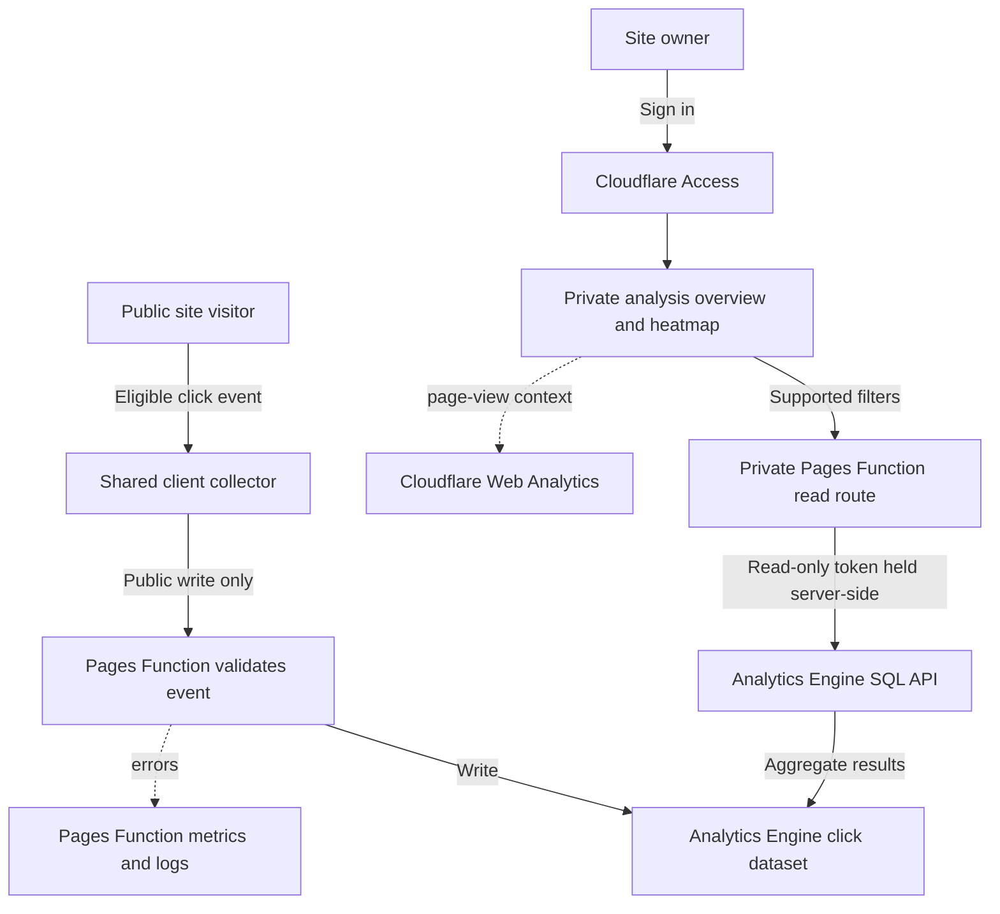

# Click Heatmap - Plan

## Goal Capsule

- **Objective:** Give the site owner reliable click-location data for comparing page layouts and deciding what to improve.
- **Product authority:** This plan defines the owner-facing click analysis experience and the anonymous click collection needed to support it.
- **Open blockers:** None for implementation. Cloudflare account configuration is an explicit release dependency, verified separately from local code checks.
- **Execution profile:** Code change to the existing static Astro site deployed on Cloudflare Pages.

## Product Contract

### Summary

Add a private analysis overview where the site owner selects a page and opens a layout-aware click heatmap. The report shows useful counts and comparisons without requiring SQL knowledge, while Cloudflare services collect and query anonymous click events.

### Problem Frame

The site owner currently makes layout decisions mostly by intuition and has no click-location data to compare against those decisions. A point plotted at an old screen coordinate can become misleading when a responsive layout or interactive state moves the target.

### Key Decisions

- **Start analysis from an overview** (session-settled: user-directed — chose the overview-first sketch because it makes page selection the entry to analysis). Governs R2 and F2.
- **Keep location data tied to the rendered layout** (session-settled: user-directed — chose layout-aware points over page-position-only points so responsive changes do not misplace clicks). Governs R4, R5, and F3.
- **Use Cloudflare for the click pipeline** (session-settled: user-directed — selected the Pages Function and Analytics Engine approach to pair click reporting with Cloudflare observability). Governs R6 and F1.
- **Restrict analysis to the owner** (session-settled: user-approved — chose a private report and read path while public pages continue collecting clicks). Governs R1 and R7.
- **Keep collection anonymous and aggregate** (session-settled: user-approved — chose useful layout data without visitor profiles or replay). Governs R5 and R8.

### Actors

- A1. Site visitor — uses public pages and generates eligible click events.
- A2. Site owner — signs in to review click counts and heatmaps.
- A3. Cloudflare Pages and Analytics Engine — validate, collect, store, query, and help diagnose the event pipeline.

### Requirements

**Analysis and interpretation**

- R1. Require Cloudflare Access authentication for the analysis overview and every route that returns click data. Allow only the configured owner identity or identities. Keep the rest of the public site and the click collection route available without signing in.
- R2. Start the owner flow in an analysis overview. Let the owner select a page, date range, and viewport class, then open that page's heatmap without writing SQL.
- R3. Show recorded click totals, per-target counts, and each target's share of recorded clicks for the selected filters. Show Cloudflare Web Analytics page views as separate context when matching page and date data are available; do not label clicks divided by page views as a conversion rate unless the underlying populations and dimensions are aligned.
- R4. Overlay click intensity only when the selected page's current layout identity matches the identity recorded with the events. When the layout changed or a target cannot be matched, show per-target counts and a clear stale-layout or unmatched-target notice instead of placing old points on the current page.

**Collection and data quality**

- R5. Collect clicks only from eligible links and buttons with stable target identifiers. Pointer activations carry target-relative location and page coordinates; keyboard activations count toward target totals without spatial coordinates. Every event carries page path, viewport class, relevant interaction state, event time, and layout/build identity. Do not record typed input or arbitrary page text.
- R6. Keep the visitor collection route public and write-only. Validate event shape, allowed page paths and target identifiers, coordinate ranges, and request size on the server; discard malformed events and fields outside the approved event contract.
- R7. Use the Analytics Engine binding to store click events and the Analytics Engine SQL API through a server-side read function to return report aggregates. Accept only the report's supported filters and query shapes; the browser must not submit arbitrary SQL.
- R8. Account for Analytics Engine sampling in reported totals using the returned sample interval. Label sampled totals as estimates and show an explicit empty or unavailable state when the selected range has no usable data. Limit the report's history to the available three-month Analytics Engine retention window unless a later archive is separately approved.

**Access, privacy, and operations**

- R9. Keep the Analytics Engine read token in an encrypted Pages Function secret with read-only account analytics permission. Never expose it to browser code, page responses, or collection events.
- R10. Do not collect visitor account identifiers, persistent visitor or session IDs, cookies, full URLs with query strings, form contents, or session recordings. The report presents aggregate click data only.
- R11. Use Cloudflare Pages Function metrics and logs to diagnose collection and query failures. Show report errors as unavailable data rather than presenting them as zero clicks; do not use operational logs as the click dataset.

### Key Flows

- F1. **Visitor click collection — Actors A1 and A3.** A visitor opens a public page and clicks an eligible target. The client sends the bounded event to the public collection route; the Pages Function validates it and writes it to Analytics Engine. Invalid events are discarded.
- F2. **Owner analysis — Actors A2 and A3.** The owner signs in through Access, selects a page, date range, and viewport, and opens the heatmap. The private read function queries Analytics Engine and returns aggregate results; the interface shows counts, click shares, and page-view context when available.
- F3. **Layout mismatch — Actors A2 and A3.** The selected page no longer matches the recorded layout identity or a target is missing. The report omits the spatial overlay, shows target counts, and explains that the layout changed or the target could not be matched.
- F4. **Data quality or service error — Actors A2 and A3.** A query returns no events, sampled results, or an error. The report distinguishes empty data, estimated totals, and unavailable data; Cloudflare operational metrics and logs help diagnose function failures.

The intended data flow is:

### Acceptance Examples

- AE1. **Access boundary.** Given a request without an allowed Access identity, when it opens the analysis overview or requests click data, then Access prevents access. Public pages and valid click collection remain available.
- AE2. **Matching layout.** Given events for the selected page, date range, and viewport with the same layout identity as the displayed page, when the owner opens the report, then it shows the heatmap and matching click statistics.
- AE3. **Stale layout.** Given the selected page has a different layout identity or a recorded target no longer exists, when the owner opens the report, then it does not plot those points at current-page coordinates and instead shows target counts with a mismatch notice.
- AE4. **Sampled results.** Given Analytics Engine returns sampled rows, when the report totals the selected events, then it accounts for each row's sample interval and labels the resulting totals as estimates.
- AE5. **No data or query failure.** Given the selected filters return no usable events or the read function fails, when the report renders, then it distinguishes no data from unavailable data and never presents the failure as zero clicks.

### Scope Boundaries

- The report covers eligible links and buttons on pages using the shared site layout. Elements without stable target identifiers are not plotted as spatial points.
- The report does not include session replay, visitor-level profiles, persistent identity or session tracking, conversion funnels, or automatic layout changes.
- Analytics Engine data beyond its three-month retention window is not archived in this work.
- Cloudflare operational logs diagnose the service pipeline; they are not exposed as visitor analytics.

### Dependencies / Assumptions

- The site is an Astro static site deployed to Cloudflare Pages. Shared client behavior is loaded from `src/layouts/Layout.astro`; the existing project carousel changes card grouping and position by viewport and slide.
- The current Pages configuration has a D1 binding but no Analytics Engine binding. Planning must define the dataset binding and verify the account supports the required Pages Function and Analytics Engine configuration.
- The Cloudflare account must have an Access identity policy for the analysis and read paths. Path rules must cover the canonical report path and its descendants without protecting the public collection path or the rest of the site.
- The Analytics Engine SQL API requires a bearer token with Account Analytics Read permission. Store that token as a Pages Function secret; provision and rotate it outside browser code.
- Analytics Engine retains data for three months and can sample writes or query results. The report therefore marks estimates and limits its selectable history to available data.
- Cloudflare Web Analytics does not support custom click events. It can supply separate page-view context; Analytics Engine remains the click event store.
- Pages Functions cannot use an Analytics Engine binding in local Pages development. Planning must include a remote preview or production verification path for the data binding.
- Cloudflare Access configuration and the project's existing Web Analytics availability have not been inspected in the account; treat both as deployment prerequisites to verify.

### Outstanding Questions

**Resolve Before Planning**

- None. The product behavior and privacy boundary are defined.

**Resolved During Planning**

- Use 7, 30, and 90 day presets with UTC boundaries and daily buckets; keep the selected dates visible.
- Use a same-origin page preview and map normalized target-local points onto explicitly registered targets. Compare layout revision, viewport, and target interaction state before drawing points.
- Pages bindings support Analytics Engine, but local Pages development cannot exercise that binding. Account bindings, Access policies, owner identities, and secrets are release setup steps documented in a runbook.
- Page-view context is optional. A configured Web Analytics GraphQL integration can supply matching path/date totals; an absent configuration or upstream failure has a distinct unavailable context state and does not suppress click results.

**Deferred to Release Configuration**

- Provision production and preview datasets, Access team/application audience and owner email allowlist, and the analytics read secret. Verify custom-domain, pages.dev, and preview host behavior after deployment.
- Confirm the optional Web Analytics zone/dataset fields and read permission in the actual account.

## Planning Contract

This is a Deep code plan: authorization, anonymous collection, sampled aggregates, and spatial interpretation cross the browser, static build, and Pages Functions. The existing Product Contract remains authoritative. Implementation proceeds without account credentials; missing private-route configuration fails closed. LFG owns review and shipping to an open PR; account provisioning and a production deployment are separate release actions.

### Key Technical Decisions

- **KTD1 — Share an explicit target manifest.** One portable contract module supplies public page paths, stable target IDs, labels, layout revisions, viewport bands, and bounded state values to collection, validation, and reports. Register meaningful navigation, CTA, contact, project, and carousel controls explicitly; do not derive identifiers from DOM text, full URLs, or runtime React IDs. This instantiates the session-settled user-approved anonymous collection choice (R5, R6, R10). Automatic selector/text capture was rejected because it can collect accidental content and unstable IDs.
- **KTD2 — Map points within their target.** Quantize pointer coordinates into a small normalized target grid; retain bounded page coordinates and build identity as diagnostic dimensions. Keyboard activations count toward target totals without spatial points. Use an authored layout revision per public page, viewport bands matching the carousel's responsive grouping, and nearest relevant interaction-state attributes. The preview draws a row only when these dimensions and its target match. This instantiates the session-settled user-directed layout-aware choice (R4, R5); raw page-coordinate replay was rejected because scrolling, responsive widths, and carousel state move targets.
- **KTD3 — Protect the origin as well as the edge.** Keep `/insights/` and its descendants behind a Function guard before static fallback, and verify Access independently in `/api/insights/report`. Verify RS256 signature against the configured team JWKS, issuer, audience, expiry, and configured owner email allowlist. Missing configuration or verification failure denies access; private responses use `Cache-Control: no-store`. Use a maintained JOSE implementation for JWT/JWKS handling. This instantiates the session-settled user-approved owner-only boundary (R1, R7, R9). A custom-domain path rule alone was rejected because preview and pages.dev hosts may bypass it.
- **KTD4 — Fixed aggregate query shapes.** The server accepts only known report mode, page, date preset, and viewport values. Analytics Engine uses the page as its single index and bounded blobs/doubles for event dimensions. Queries group target-local cells and daily counts, weighting each row by `_sample_interval`; no client SQL is accepted (R3, R7, R8). Limit result size, upstream duration, and response schema; the dashboard distinguishes errors from empty data.
- **KTD5 — Preview the real page without collecting it.** The private React island embeds only allowlisted same-origin public routes at a representative width for the selected viewport. Preview mode disables collection without cookies. Overlay nodes have no pointer interception; safe carousel controls can change the preview state, while link navigation is intercepted inside the preview. Target counts remain visible for stale, hidden, or unmatched points (R2, R4, F3).
- **KTD6 — Bound anonymous telemetry and state its meaning.** Accept one event per POST with a small byte limit, exact field validation, same-origin request checks, a page/target allowlist, and finite coordinate/state limits. The browser sends once per trusted activation using keepalive delivery and never delays navigation. No visitor IDs are used for deduplication. Counts mean received eligible events, not unique people; schema checks cannot prove a human sent them. Document an optional Cloudflare edge rate rule and request/error monitoring (R6, R10, R11).

## High-Level Technical Design

Directional design, not implementation code:

| Surface                      | Responsibility                                                                                 |
| ---------------------------- | ---------------------------------------------------------------------------------------------- |
| `shared/heatmap-contract.js` | Page/target registry, layout revisions, viewport bands, validation and report filter contract  |
| Shared collector             | Read explicit DOM metadata; emit bounded anonymous events; skip private pages and preview mode |
| `POST /api/click-events`     | Validate one event; write to `CLICK_EVENTS`; return no analytics data                          |
| Private page guard           | Validate signed owner Access identity before serving `/insights/` HTML                         |
| `GET /api/insights/report`   | Authenticate, create fixed queries, weight aggregates, optionally obtain page-view context     |
| `/insights/` island          | Overview first; page/date/viewport filters; selected page heatmap and count table              |
| Same-origin page preview     | Match target/local-grid data to current layout/state; omit mismatches and display notices      |

The dataset uses the server ingestion timestamp for query windows and retains the bounded client event time for diagnostics. Aggregate responses include sampling status, applied filters, target counts/shares, point cells by layout/state, and daily totals. API credentials and JWT verification configuration never enter static build output.

## Implementation Units

### U1 — Shared event and report contracts

- **Goal:** Establish one deterministic registry and bounded payload/filter rules.
- **Trace:** R4–R8, R10; F1/F3; AE2–AE4; KTD1/KTD2/KTD4/KTD6.
- **Dependencies:** None.
- **Files:** `shared/heatmap-contract.js`, `scripts/heatmap-contract.test.mjs`, `package.json`.
- **Approach:** Define public route metadata and stable target registration, viewport bands, layout revisions, position-less keyboard events, and supported report presets. Keep browser/server contract imports portable.
- **Patterns:** Checked-in public route metadata in `src/data/site-routes.ts`; pure Node tests with injected inputs in `scripts/github-activity-snapshot.test.mjs`.
- **Test scenarios:** Known pointer/keyboard events pass; unknown route/target/field, mismatched target/path, non-finite or out-of-range coordinates, oversized state, and unsupported report filters fail. The grid maps edge clicks deterministically and includes all public pages while excluding the private route.
- **Verification:** Contract tests prove valid events and report filters have a single accepted representation.

### U2 — Anonymous collection and stable DOM targets

- **Goal:** Collect eligible activations without disrupting public interactions.
- **Trace:** R5/R6/R10; F1; KTD1/KTD2/KTD6.
- **Dependencies:** U1.
- **Files:** `src/scripts/client/click-heatmap.ts`, `src/layouts/Layout.astro`, `src/components/navigation/Navigation.tsx`, `src/components/navigation/SwipeNavigation.tsx`, `src/components/Footer.astro`, public page components under `src/components/`, `src/components/projects/carousel/ProjectCarousel.tsx`, `scripts/heatmap-collector.test.mjs`.
- **Approach:** Follow the shared client import seam, add explicit metadata to meaningful controls, and record nearest relevant carousel state. Derive identity from the manifest and build metadata. Preview mode and private pages skip collection.
- **Patterns:** `Layout.astro` client script imports; carousel's existing resize grouping and active/inert slide semantics.
- **Test scenarios:** A trusted link click sends one bounded event, nested-icon clicks resolve their eligible parent, keyboard activation sends a target-only event, and scripted/unregistered clicks are skipped. Navigation continues on network failure; private/preview routes send nothing. Carousel events use the active grouping/state and inactive slides remain inert.
- **Verification:** Existing navigation/carousel behavior remains usable and representative events match the shared contract.

### U3 — Public write-only ingestion

- **Goal:** Persist bounded eligible events to Analytics Engine.
- **Trace:** R6/R7/R10/R11; F1/F4; KTD4/KTD6.
- **Dependencies:** U1.
- **Files:** `functions/api/click-events.js`, `functions/_shared/heatmap-storage.js`, `scripts/heatmap-ingestion.test.mjs`, `workers/front-door/src/index.js`, `workers/front-door/tests/`, `wrangler.toml`.
- **Approach:** Add a file-based POST route with streamed byte limit, method/origin/schema guards, and exactly one binding write. Preserve request bodies through the existing front-door proxy and validate Origin against an explicit configured list of public site origins, since the proxy changes the upstream hostname. Handle missing binding/write failure as an operational error without returning raw event data or upstream internals.
- **Patterns:** Existing Pages Function exports and `context.env`; official Pages Analytics Engine binding configuration.
- **Test scenarios:** Valid POST writes the mapped dimensions once and returns an empty success response. A canonical-domain POST retains body through the front-door proxy and its allowed Origin passes at Pages; an unrelated Origin fails. Wrong method, oversized body, invalid JSON, extra fields, and unknown target/path do not write. Missing binding/write exceptions return a generic error. Responses never provide report data.
- **Verification:** Mock-binding tests distinguish accepted, rejected, and failed writes; Wrangler can compile the Function bundle.

### U4 — Private authentication and aggregate reads

- **Goal:** Enforce owner access on HTML and data while returning useful weighted reports.
- **Trace:** R1/R3/R7–R11; F2/F4; AE1/AE4/AE5; KTD3/KTD4.
- **Dependencies:** U1/U3.
- **Files:** `functions/_shared/access.js`, `functions/insights/[[path]].js`, `functions/api/insights/report.js`, `functions/_shared/heatmap-report.js`, `functions/_middleware.js`, `workers/front-door/src/index.js`, `scripts/heatmap-access.test.mjs`, `scripts/heatmap-report.test.mjs`, `package.json`, `pnpm-lock.yaml`.
- **Approach:** Add shared JOSE verification with configured owner allowlist; protect the page before static fallback and verify the data handler independently. Exclude private HTML/data paths from Markdown conversion in both Pages middleware and the front-door Worker, since conversion rebuilds headers; preserve public Markdown negotiation. Issue only server-owned AE query shapes, validate upstream rows, and compute sample-aware counts/shares. Add optional bounded Web Analytics context through server-side configuration.
- **Patterns:** Existing middleware static fallback; fetch injection and upstream response validation in GitHub Activity scripts.
- **Test scenarios:** Valid signed allowed owner is accepted; absent header/config, expired token, wrong signature/issuer/audience/email and malformed JWT fail closed on both page and API. Accept: text/markdown cannot remove private no-store headers or transform private data at either middleware layer. Fixed queries reject unsupported filters and SQL injection strings. Varying sample intervals yield correct target/day/cell counts and shares. Empty, invalid, timeout, and upstream failures remain distinct. Optional page-view failure leaves click aggregates intact; no response contains credentials.
- **Verification:** Cryptographic test tokens establish the origin boundary; deterministic upstream fixtures establish weighted report semantics.

### U5 — Overview and layout-aware heatmap interface

- **Goal:** Make page selection and click interpretation accessible without SQL.
- **Trace:** R2–R4/R8/R11; F2–F4; AE2–AE5; KTD2/KTD5.
- **Dependencies:** U1/U2/U4.
- **Files:** `src/pages/insights.astro`, `src/components/insights/ClickInsights.tsx`, `src/components/insights/ClickInsights.css`, `src/components/insights/heatmap-preview.js`, `scripts/heatmap-preview.test.mjs`, `src/layouts/Layout.astro`.
- **Approach:** Implement selected B with existing site tokens: overview page totals, date/viewport filters, then a selected page preview and ranked target table. During filter changes show loading and withhold the previous heatmap/counts; cancel or ignore older requests and apply only the latest matching response. Keep the representative preview width inside a labelled keyboard-accessible scroll region on narrow screens. Render weighted cells as an intensity layer in the current target boxes. Observe layout/state changes and only show matching points; provide explicit notices and text counts for stale/unmatched/keyboard-only results. Add noindex metadata and collection opt-out for the private page.
- **Patterns:** Page-local hydrated React islands, existing surface/text/accent tokens, accessible buttons and active/inert carousel state.
- **Test scenarios:** Matching target/state draws normalized points; different revision/viewport/state and absent or hidden target skip points with notices. Preview navigation cannot silently change the selected page and never sends events. Rapid filter changes never apply an older response or associate old counts with a new preview; failure has a visible retry. Empty, sampled, unavailable, and optional context states are readable. Narrow/wide viewports, wide preview scrolling on mobile, keyboard use, focus indicators, and light/dark mode remain usable.
- **Verification:** Pure overlay matching tests plus real browser inspection demonstrate the B flow and honest spatial fallback.

### U6 — Build, deployment contract, and operating guide

- **Goal:** Keep private routes out of public discovery and make Cloudflare setup reviewable.
- **Trace:** R1/R8–R11; AE1/AE5; KTD3/KTD6.
- **Dependencies:** U2–U5.
- **Files:** `scripts/verify-build.mjs`, `scripts/heatmap-build.test.mjs`, `docs/cloudflare-click-heatmap.md`, `package.json`, `wrangler.toml`.
- **Approach:** Extend build checks for the private artifact/noindex without adding it to `SITE_ROUTES`, navigation, sitemap, or discovery. Document production/preview binding separation, encrypted read token, Access identity/audience/owner settings, all host types, optional page-view context, layout revision maintenance, sample semantics, and operational metrics/logs.
- **Patterns:** Current route/build verification scripts; separate D1 GitHub Activity snapshot pipeline remains its own data source.
- **Test scenarios:** Private HTML exists and is noindex; public route/discovery manifests exclude it; static output contains no secret values; existing public routes remain valid. Missing runtime settings fail closed rather than exposing data. Runbook separately names local mock checks, compiled Functions, account configuration, and deployed binding/auth checks.
- **Verification:** Build/route checks pass and documented release checks do not imply unperformed deployment proof.

## System-Wide Impact

- Shared DOM metadata and collector affect public pages but never await collection before navigation. One request represents one eligible activation; no event or JWT is logged wholesale.
- The private Function guard must match the static report route and its descendants. Read data cannot rely only on edge policy. All private responses bypass caches; missing account settings deny access.
- The canonical-domain front-door Worker must preserve POST bodies and private no-store responses while forwarding Access assertions. The collector's public origin allowlist must include the canonical hostname explicitly rather than trusting arbitrary forwarded-host headers.
- Analytics Engine timestamps, sampling, retention, and optional Web Analytics context are independent of the existing D1 latest-success GitHub Activity snapshot. Query failure must not become a zero count.
- Overlays are target-local and non-intercepting; carousel changes must trigger state rematching. A new target layout requires a manifest revision before deploying geometry changes.

## Risks & Dependencies

- **Anonymous spam/duplicates:** Strict input bounds limit malformed writes but cannot prove unique humans. Label event counts accurately, monitor function request/error volume, and document an account-level edge rate rule where supported. Do not add persistent visitor IDs.
- **Cloudflare configuration:** Dataset bindings, read token, Access team/audience/allowed-owner values, and all-host policies require account setup. Private paths fail closed until configured. Real AE writes and Access sign-in require a deployed environment.
- **Layout maintenance:** Explicit revisions must be bumped with relevant geometry changes. Mismatches fall back to target counts; the runbook documents this responsibility.
- **Optional page views:** Account GraphQL fields/permissions may differ. Keep this context independent and unavailable when unconfigured or incompatible; never manufacture a denominator.

## Verification Contract

Protect the behavior with focused Node built-in tests for contracts, ingestion, cryptographic Access validation, sampled aggregate fixtures, and overlay matching. Inspect the existing tests first; prove rejection/failure cases as well as valid cases. Use the repository lint, typecheck, build, route-manifest and deployment-contract checks, plus a Pages Functions compile check. Build data synchronization should use existing offline/snapshot paths where credentials or network availability prevent a reproducible local check.

Browser verification covers overview → page selection → heatmap, matching/stale/sample/empty/error fixtures, preview collection suppression, navigation and carousel preservation, and narrow/wide light/dark views. Fixtures are local verification inputs, visibly distinguished from live data, and must not create a deployed auth bypass or production mock path.

Release verification is separately reported: actual dataset binding write/query, owner/unauthorized Access requests, no-store responses, and custom-domain/pages.dev/preview host coverage. A local mock or Wrangler compile is not evidence these account settings are live.

## Definition of Done

- U1–U6 satisfy their scenarios and the Product Contract's AE1–AE5 have code or browser evidence.
- Eligible public controls emit bounded anonymous events; private and preview controls do not pollute the dataset.
- Signed owner validation protects report HTML and every data read, with no configuration bypass.
- The owner can use the B overview flow, review weighted totals/shares, and see spatial points only for matching target layout/state.
- Empty, unavailable, sampled, stale, and optional page-view context states are distinct.
- Private route discovery/build checks and the Cloudflare setup/runbook are complete; actual account provisioning/deployment remains explicitly unverified unless performed.
- Required local checks and LFG review/browser stages are complete; changes are committed and submitted in a PR with remote CI results reported separately.

## Sources / Research

- Existing ideation selections and behavior: `docs/ideation/2026-10-04-cloudflare-click-heatmap-ideation.html`.
- Static Pages output and current bindings: `astro.config.mjs:5-10` and `wrangler.toml:2-13`.
- Shared client entry point: `src/layouts/Layout.astro:2-7,109-128`.
- Responsive carousel behavior that can move click targets: `src/components/projects/carousel/ProjectCarousel.tsx:18-23,25-48,55-73,99-110`.
- Existing Pages Function middleware: `functions/_middleware.js:7-19`.
- [Cloudflare Access application paths](https://developers.cloudflare.com/cloudflare-one/access-controls/policies/app-paths/) — path-specific protection and wildcard behavior.
- [Access JWT validation](https://developers.cloudflare.com/cloudflare-one/access-controls/applications/http-apps/authorization-cookie/validating-json/) — origin signature, issuer and audience validation.
- [Pages preview deployments](https://developers.cloudflare.com/pages/configuration/preview-deployments/) and [Pages known issues](https://developers.cloudflare.com/pages/platform/known-issues/) — distinct preview, pages.dev and custom-domain Access configuration.
- [Pages Functions bindings and secrets](https://developers.cloudflare.com/pages/functions/bindings/) — Analytics Engine write binding, local development limitation, and encrypted server-side secrets.
- [Workers Analytics Engine SQL API](https://developers.cloudflare.com/analytics/analytics-engine/sql-api/) — bearer-token access, read permission, and sampled-row metadata.
- [Workers Analytics Engine sampling](https://developers.cloudflare.com/analytics/analytics-engine/sampling/) — sample-aware aggregate calculations.
- [Workers Analytics Engine limits](https://developers.cloudflare.com/analytics/analytics-engine/limits/) — three-month retention.
- [Cloudflare Web Analytics FAQ](https://developers.cloudflare.com/web-analytics/faq/) — custom events are not supported.
- [Pages Functions debugging and logging](https://developers.cloudflare.com/pages/functions/debugging-and-logging/) and [Functions metrics](https://developers.cloudflare.com/pages/functions/metrics/) — deployment diagnostics and request health.
